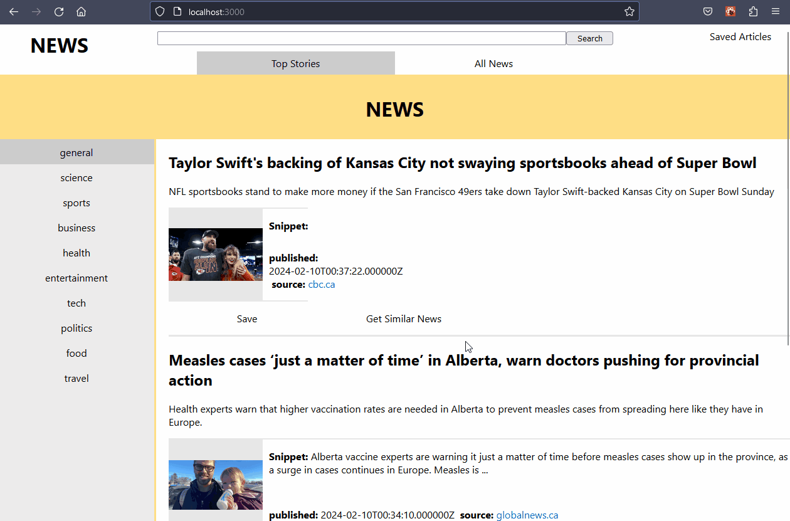
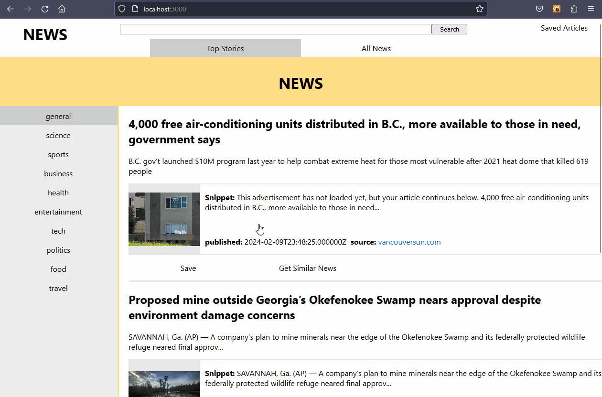
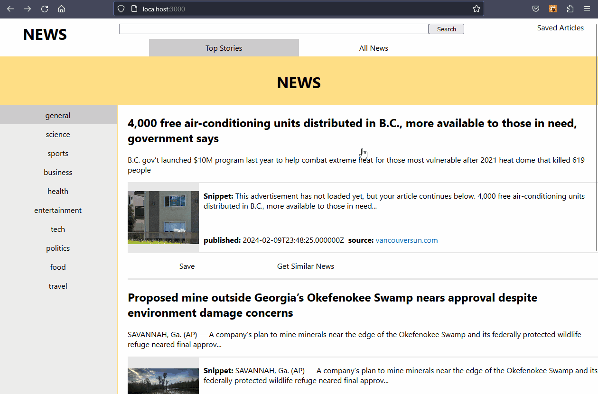

# NewsApp

A news app created with react using [TheNewsAPI](https://www.thenewsapi.com/) to get the news data.

# Demo

### Main page navigation showing category selector, news tabs, search, and infinite scrolling

### Getting similar news

### Saving articles feature

### Clicking cards redirects to the external article or source url

